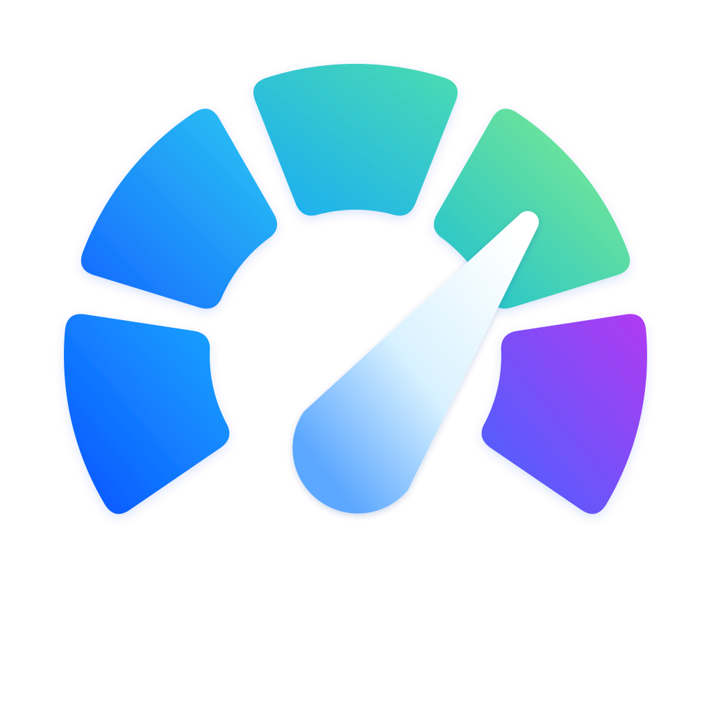

# AI Gauge

  

A lightweight Windows tray widget for monitoring OpenAI Codex and Google Antigravity usage.

  
  

## Features

- View remaining Codex quotas and reset times for the 5-hour and 7-day windows.
- View Google Antigravity (`agy`) model-group quotas and reset times.
- Refresh usage automatically in the background at a configurable interval.
- Keep the widget in the Windows system tray.
- Choose Light, Dark, or System appearance.
- Configure Warning and Critical thresholds for usage bars.

## Usage

Open AI Gauge from the Start menu or system tray. Left-click the tray icon to show the widget.
Use the Settings button to choose a theme, configure thresholds, or change the refresh interval.
Closing the widget hides it to the tray; choose **Exit** from the tray menu to quit completely.

## Requirements

- Windows 10 or Windows 11 (64-bit)
- A local OpenAI Codex login session
- The Google Antigravity `agy` command-line tool, if Antigravity usage is needed

## How it works

AI Gauge is a standalone Windows application. It reads the local Codex login session and invokes
the locally installed `agy` command-line tool when Antigravity usage is enabled. It then displays
the retrieved usage information in the widget.

## Privacy

AI Gauge is a standalone local application. Usage data is processed and displayed on your
Windows device and is not stored by AI Gauge. AI Gauge does not request or store passwords,
payment information, or unrelated personal data. It uses the existing local Codex login session
and the authentication managed by `agy` without storing a separate copy of their credentials.

Any network communication and data handling by connected services are governed by their own
authentication and privacy policies.

## Troubleshooting

- If Codex data is unavailable, verify that the local Codex login session is active.
- If Antigravity data is unavailable, verify that `agy` is installed and available to the app.
- Check the status dot tooltip for failure count, last successful fetch, last error, and next fetch.

## For developers

See [docs/development.md](docs/development.md) for build, test, frontend preview, screenshot,
and MSIX packaging instructions.

## License

Licensed under the Apache License, Version 2.0. See [LICENSE](LICENSE) for the full license text.
