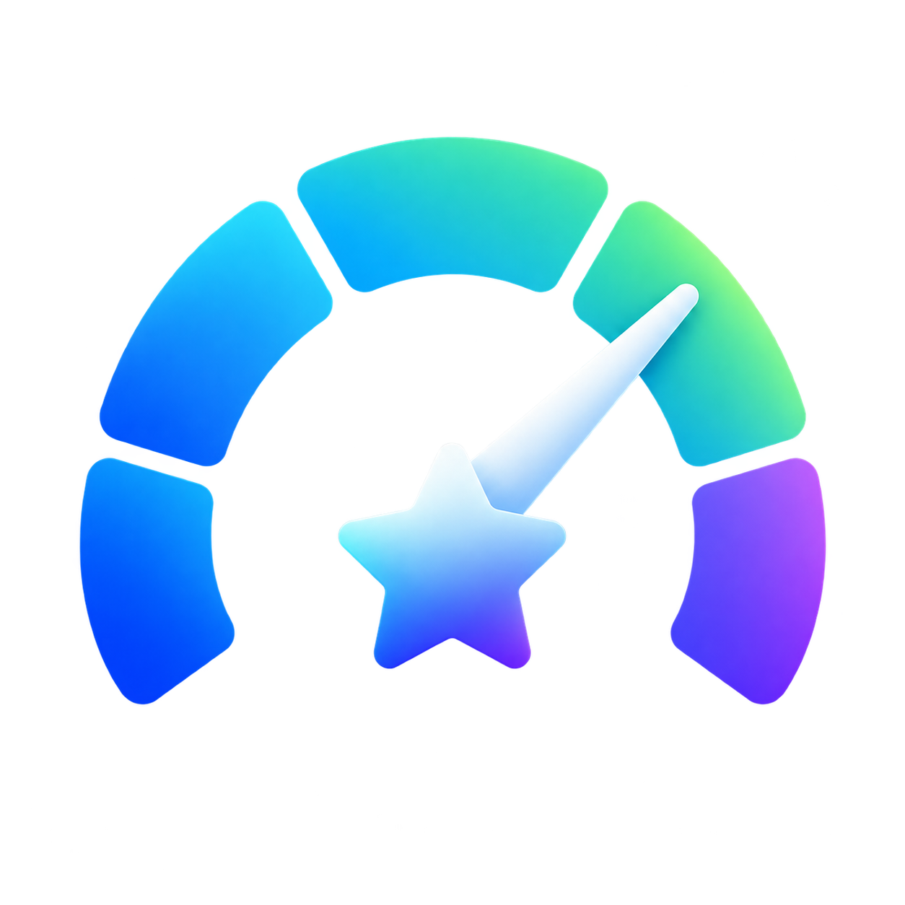
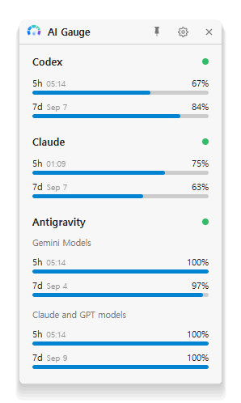
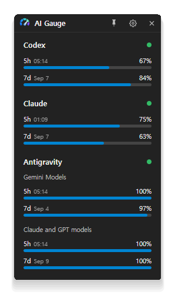

# AI Gauge

  

A lightweight Windows tray widget for monitoring OpenAI Codex and Google Antigravity usage.

  
  

## Features

- View remaining Codex quotas and reset times for the 5-hour and 7-day windows.
- View Google Antigravity (`agy`) model-group quotas and reset times.
- Refresh usage automatically in the background.
- Keep the widget in the Windows system tray.
- Choose Light, Dark, or System appearance.
- Configure Warning and Critical thresholds for usage bars.

## Requirements

- Windows 10 or Windows 11 (64-bit)
- A local OpenAI Codex login session
- The Google Antigravity `agy` command-line tool, if Antigravity usage is needed

## How it works

AI Gauge runs locally. It reads the local Codex login session and invokes the locally installed
`agy` command-line tool. Usage data is displayed in the widget and is not sent to an AI Gauge
intermediary server. The connected services handle their own authentication and privacy policies.

## Usage

Open AI Gauge from the Start menu or system tray. Left-click the tray icon to show the widget.
Use the Settings button to choose a theme or configure thresholds. Closing the widget hides it
to the tray; choose **Exit** from the tray menu to quit completely.

## Privacy

AI Gauge does not request or store passwords, payment information, or unrelated personal data.
Credentials remain managed by the local service or login tool. For the complete policy, see the
privacy policy published with the Microsoft Store listing.

## Known Issues

- `agy 1.1.22` expects a Windows console/TTY when used with `-p` for usage queries. In my
  testing, a PowerShell/console window may briefly flash during some Antigravity usage
  refreshes. The behavior appears closely related to the upstream issue, although the exact
  cause has not been confirmed. As of August 30, 2026, the related upstream issue is still open:
  [agy issue #508](https://github.com/google-antigravity/antigravity-cli/issues/508). If this
  occurs, it is a known issue rather than an indication that AI Gauge is launching an interactive
  command.

## Troubleshooting

- If Codex data is unavailable, verify that the local Codex login session is active.
- If Antigravity data is unavailable, verify that `agy` is installed and available to the app.
- Check the status dot tooltip for failure count, last successful fetch, last error, and next fetch.

## For developers

See [docs/development.md](docs/development.md) for build, test, frontend preview, screenshot,
and MSIX packaging instructions.

## License

Licensed under the Apache License, Version 2.0. See [LICENSE](LICENSE) for the full license text.
